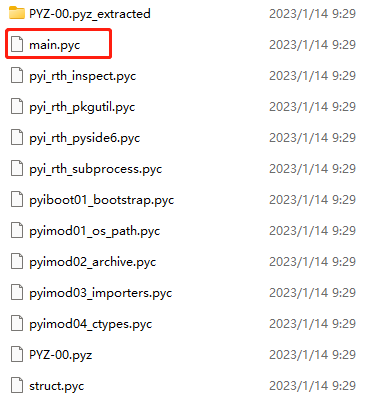

# pyisrepack

### **Introduce**
***
Repack the pyc file into the exe generated by PyInstaller.<br>
This project is based on [pyinstxtractor](https://github.com/extremecoders-re/pyinstxtractor)

### **Repository**
https://gitee.com/bruce_code/pyisrepack.git<br>
https://github.com/bruce-yan/pyisrepack.git

### **Usage**
***
```
Usage: python pyisrepack.py -ori <exe file> -p <pyc file> -o <output file>
```

### **How To Do**
*** 
This is the Demo code, use PyInstaller to package it as main.exe
```python
import sys
from PySide6.QtCore import Qt
from PySide6.QtWidgets import QApplication, QLabel


def main():
    app = QApplication(sys.argv)
    label = QLabel("Hello world.", alignment=Qt.AlignmentFlag.AlignCenter)
    label.resize(300, 200)
    label.show()
    sys.exit(app.exec())


if __name__ == "__main__":
    main()
```
Run


We will change 'Hello world' to 'Hello earth' by following steps
#### Step1. Use [pyinstxtractor](https://github.com/extremecoders-re/pyinstxtractor) to extract main.pyc from main.exe
```
python pyinstxtractor.py main.exe
```
Get the following files



#### Step2. Use [uncompyle6](https://github.com/rocky/python-uncompyle6) Decompile pyc files to python source files
```
uncompyle6 -o . main.pyc
```

#### Step3. Modify python code
```
label = QLabel("Hello earth.", alignment=Qt.AlignmentFlag.AlignCenter)
```

#### Step4. Compile modified python source code to pyc
```
uncompyle6 -c main.py
```

#### Step5. Use pyisrepack.py repack pyc into exe
```
python pyisrepack.py -ori main.exe -p main.pyc -o new_main.exe
```

#### Step6. Run


### **Important**
***
* Try to ensure that the Python version is consistent before and after modification
* Currently only supports entries of type "s"

### Use pyi-archive_viewer to view entry types
***
```
 pos, length, uncompressed, iscompressed, type, name
[(0, 225, 293, 1, 'm', 'struct'),
 (225, 1025, 1706, 1, 'm', 'pyimod01_os_path'),
 (1250, 4025, 8765, 1, 'm', 'pyimod02_archive'),
 (5275, 7386, 17758, 1, 'm', 'pyimod03_importers'),
 (12661, 1456, 3638, 1, 'm', 'pyimod04_ctypes'),
 (14117, 824, 1364, 1, 's', 'pyiboot01_bootstrap'),
 (14941, 512, 797, 1, 's', 'pyi_rth_subprocess'),
 (15453, 701, 1065, 1, 's', 'pyi_rth_pkgutil'),
 (16154, 439, 660, 1, 's', 'pyi_rth_inspect'),
 (16593, 330, 441, 1, 's', 'pyi_rth_pyside6'),
 (16923, 381, 529, 1, 's', 'main'),
 (17304, 1173690, 1173690, 0, 'z', 'PYZ-00.pyz')]
```

### See Also
***
* https://github.com/extremecoders-re/pyinstxtractor
* https://github.com/rocky/python-uncompyle6

### License
***
GNU General Public License v3.0